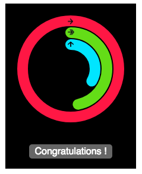

# react-activity-circle [](https://travis-ci.org/hourliert/react-component-seed)

This component is a activity circle indicator with dynamic boost message.



## Getting started

first, clone the projet on your workspace :

```
git clone ssh://git@git.wid.la:10022/wid/react-seed-component.git
```

To start the playground, simply run:


```
cd react-seed-component
npm install
npm start
```


The playground has **react-hot-reload** so you can edit your component and see the result in real time.

## Props

* goal: Number
* move: Number
* stand: Number
* exercise: Number


## Project structure
* `./src`: Source code
* `./src/__tests__/`: Test code
* `./playground`: Playground source code
* `./types`: Additionnal typescript definition files

## Tasks
* `npm start`: Start the playground and compile the component on file change
* `npm test`: Run all component tests in **jest**
* `npm run lint`: Lint the code of the component
* `npm run tdd`: Run all component tests in watch mode
* `npm run release -- -- semverComptaibleString`: Create a new component version.
